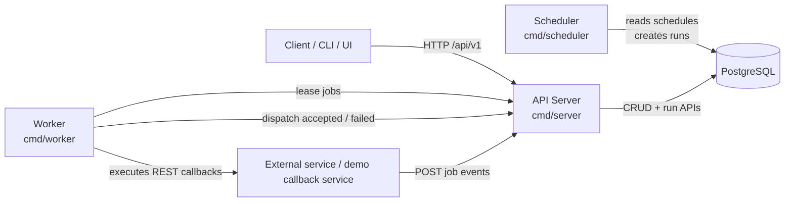
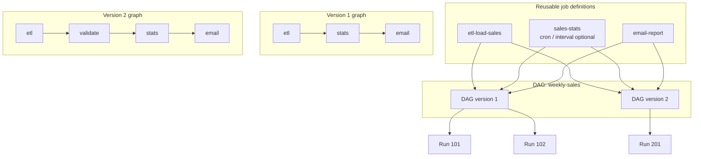
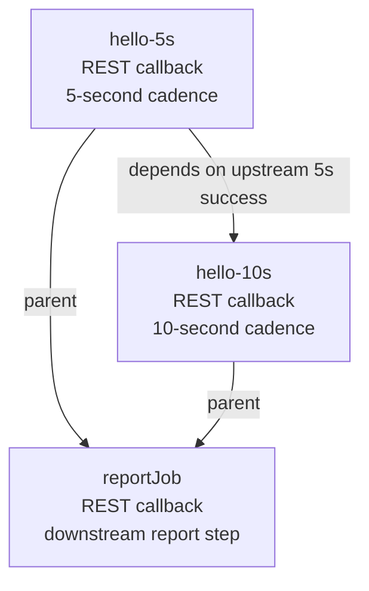

# Chronosched

Chronosched is a PostgreSQL-backed DAG scheduler written in Go.

Its core idea is to treat **job definitions**, **schedules**, and **DAG orchestration** as separate first-class concepts.

Chronosched separates three concerns into independent concepts:

- **job definitions** describe reusable work
- **schedules** belong to job definitions
- **DAG versions** define orchestration and dependencies

At runtime, the scheduler creates **runs**, and each run materializes one or more **jobs** that the worker executes.

## Quick start (local demo)

Run the full stack locally:

```bash
docker compose up --build -d
```

Check the API server:

```bash
curl http://localhost:8080/healthz
```

Expected:

```json
{"status":"ok"}
```

Open the API UI:

http://localhost:8080/


## Design goals

Chronosched focuses on a few core design principles:

- **Separation of concerns** between job definitions, schedules, and orchestration
- **Reusable job definitions** across multiple workflows
- **Immutable DAG versions** so workflows can evolve safely
- **Deterministic execution semantics** for reliable orchestration
- **Durable state management** backed by PostgreSQL
- **API-first integration** with external workers and services
- **Explicit orchestration model** separating task definitions from workflow structure


## Why this design

A single job definition can be reused across multiple workflows.

For example, `sales-stats` might:

- run by itself on a weekly cadence
- appear after `etl-load-sales` in one DAG
- appear after `load -> validate` in another DAG

The schedule stays attached to the definition, while dependency ordering stays attached to the DAG version.

That split makes reuse easier and allows workflows to evolve through new DAG versions without changing the underlying task definitions.

## When to use Chronosched

Chronosched is designed for systems that require deterministic
workflow orchestration with reusable job definitions.

Typical scenarios include:

- **data pipelines** where the same tasks appear in multiple workflows
- **batch processing systems** whose orchestration evolves over time
- **internal platform services** that expose scheduling via an API
- **automation systems** that need durable execution state
- **multi-tenant environments** where workflows must be isolated by namespace

Because schedules, job definitions, and orchestration graphs are
independent concepts, Chronosched works well in environments where
workflows may change while the underlying tasks remain reusable.

## System architecture



### Components

- **API server** exposes the REST API, worker gateway, and Swagger/OpenAPI UI.
- **Scheduler** scans for due schedules and creates runs.
- **Worker** leases queued jobs, dispatches them, and tracks dispatch outcomes.
- **PostgreSQL** stores namespaces, definitions, DAGs, DAG versions, runs, jobs, and queue state.

## Core model

### Namespaces

Namespaces are the top-level isolation boundary.

Typical examples:

- `finance`
- `analytics`
- `billing`

### Job definitions

A job definition describes reusable work.

Examples:

- `etl-load-sales`
- `sales-stats`
- `email-report`
- `cleanup-temp-files`

A definition includes:

- logical identity and metadata
- execution kind
- payload template
- optional schedule
- enabled / paused state

### Schedules

Schedules live on **job definitions**, not on DAGs.

#### Interval example

```json
{
  "schedule": {
    "type": "interval",
    "interval_seconds": 10,
    "start_at": "2026-03-06T12:04:57Z"
  }
}
```

#### Cron example

```json
{
  "schedule": {
    "type": "cron",
    "cron": "0 23 * * 0",
    "timezone": "America/New_York"
  }
}
```

### DAGs and DAG versions

A **DAG** is the stable workflow identity.

A **DAG version** is an immutable snapshot of:

- nodes
- edges
- bindings from nodes to job definitions

Only one version is active for a DAG at a time.

### Runs and jobs

A **run** is a concrete execution of a DAG version.

- **manual runs** materialize the whole DAG
- **scheduled runs** start from the scheduled node and allow downstream work to proceed when dependencies are satisfied

A run contains runtime **jobs**.

## Definitions vs DAG versions vs runs



The same definitions can be reused while the orchestration evolves through new DAG versions.

## Job execution lifecycle

```mermaid
flowchart LR
    Due[Definition schedule becomes due] --> Scheduler[Scheduler creates run]
    Scheduler --> Waiting[Jobs inserted as waiting or queued]
    Waiting --> Ready[Dependencies satisfied]
    Ready --> Lease[Worker leases queued job]
    Lease --> Dispatch[Worker dispatches execution]
    Dispatch --> Started[Callback posts started]
    Started --> Heartbeat[Optional heartbeat]
    Heartbeat --> Done[Callback posts succeeded or failed]
    Done --> Refresh[Run status refreshed]
```



Common job states include:

- `waiting`
- `queued`
- `dispatching`
- `dispatched`
- `running`
- `succeeded`
- `failed`
- `lost`
- `missed`
- `cancelled`
- `skipped`

## Project layout

```text
chronosched/
├── cmd/
│   ├── scheduler/
│   ├── server/
│   └── worker/
├── client/
│   └── python/
├── internal/
│   ├── api/
│   ├── dag/
│   ├── dal/
│   │   └── sql/
│   ├── logger/
│   ├── repository/
│   ├── scheduler/
│   ├── scripts/
│   └── worker/
├── migrate/
│   └── initdb/
├── openapi/
│   └── chronosched.yaml
├── docker-compose.yml
└── docker-compose.debug.yml
```

## API overview

All public endpoints are rooted under **`/api/v1`**.

### Namespaces

- `GET /api/v1/namespaces`
- `POST /api/v1/namespaces`
- `GET /api/v1/namespaces/{name}`

### Job definitions

- `GET /api/v1/namespaces/{namespace_id}/job-definitions`
- `POST /api/v1/job-definitions`
- `GET /api/v1/job-definitions/{definition_id}`
- `PUT /api/v1/job-definitions/{definition_id}`
- `DELETE /api/v1/job-definitions/{definition_id}`
- `POST /api/v1/job-definitions/{definition_id}/enable`
- `POST /api/v1/job-definitions/{definition_id}/disable`
- `POST /api/v1/job-definitions/{definition_id}/pause`
- `POST /api/v1/job-definitions/{definition_id}/resume`
- `GET /api/v1/job-definitions/{definition_id}/usages`

### DAGs and versions

- `GET /api/v1/namespaces/{namespace_id}/dags`
- `POST /api/v1/namespaces/{namespace_id}/dags`
- `GET /api/v1/dags/{dag_id}`
- `DELETE /api/v1/dags/{dag_id}`
- `GET /api/v1/dags/{dag_id}/versions`
- `POST /api/v1/dags/{dag_id}/versions`
- `GET /api/v1/dag-versions/{dag_version_id}`
- `GET /api/v1/dag-versions/{dag_version_id}/graph`
- `POST /api/v1/dag-versions/{dag_version_id}/activate`
- `POST /api/v1/dag-versions/{dag_version_id}/revert`

### Runs and jobs

- `POST /api/v1/dags/{dag_id}/runs`
- `GET /api/v1/dags/{dag_id}/runs`
- `GET /api/v1/runs/{run_id}`
- `GET /api/v1/runs/{run_id}/jobs`
- `GET /api/v1/runs/{run_id}/graph`
- `GET /api/v1/jobs/{job_id}/readiness`
- `POST /api/v1/jobs/{job_id}/events`

### Internal worker gateway

- `POST /internal/workers/lease`
- `POST /internal/workers/dispatch-result`

## Running the project

### Start everything

```bash
docker compose up --build -d
```

This starts:

- PostgreSQL
- API server on `http://localhost:8080`
- scheduler
- worker
- Python callback demo service on `http://localhost:8090`

### Check health

```bash
curl http://localhost:8080/healthz
```

Expected response:

```json
{"status":"ok"}
```

### Open the API UI

Open:

```text
http://localhost:8080/
```

The OpenAPI document is served from:

```text
http://localhost:8080/openapi/chronosched.yaml
```

## Callback demo service

The Python demo service under `client/python` exposes callback endpoints used by the worker.

The demo defines three jobs:

• hello-5s — a REST callback job scheduled every 5 seconds
• hello-10s — a REST callback job scheduled every 10 seconds
• reportJob — a REST callback job representing a downstream summary/report step

Their dependencies are:

• hello-10s depends on hello-5s
• reportJob depends on hello-5s
• reportJob depends on hello-10s

This creates a small DAG containing two common patterns:

• Sequential dependency: hello-5s → hello-10s
• Fan-in dependency: hello-5s and hello-10s both feed into reportJob

In other words, reportJob sits downstream of both upstream jobs and represents a node that requires multiple predecessors to complete before it can run successfully.



Typical log output from the Python service looks like this:

```text
python-service-1  | INFO:     Started server process [1]
python-service-1  | INFO:     Waiting for application startup.
python-service-1  | INFO:     Application startup complete.
python-service-1  | INFO:     Uvicorn running on http://0.0.0.0:8090 (Press CTRL+C to quit)
python-service-1  | INFO:     <IP:PORT> - "POST /jobs/hello-5s HTTP/1.1" 200 OK
python-service-1  | INFO:     <IP:PORT> - "POST /jobs/hello-5s HTTP/1.1" 200 OK
python-service-1  | INFO:     <IP:PORT> - "POST /jobs/hello-10s HTTP/1.1" 200 OK
python-service-1  | INFO:     <IP:PORT> - "POST /jobs/reportJob HTTP/1.1" 200 OK
python-service-1  | INFO:     <IP:PORT> - "POST /jobs/hello-5s HTTP/1.1" 200 OK
python-service-1  | INFO:     <IP:PORT> - "POST /jobs/hello-5s HTTP/1.1" 200 OK
python-service-1  | INFO:     <IP:PORT> - "POST /jobs/hello-10s HTTP/1.1" 200 OK
python-service-1  | INFO:     <IP:PORT> - "POST /jobs/reportJob HTTP/1.1" 200 OK
python-service-1  | INFO:     <IP:PORT> - "POST /jobs/hello-5s HTTP/1.1" 200 OK
python-service-1  | INFO:     Shutting down
python-service-1  | INFO:     Waiting for application shutdown.
python-service-1  | INFO:     Application shutdown complete.
python-service-1  | INFO:     Finished server process [1]
```

## Minimal end-to-end example

The example below recreates the **same fan-out / fan-in DAG used by the Python demo service**, but runs it manually through the API so the full dependency behavior can be observed immediately.

The workflow contains three nodes:

• **hello5** → executes the `hello-5s` job definition  
• **hello10** → executes the `hello-10s` job definition  
• **reportJob** → executes the `reportJob` job definition  

with the following dependencies:

• `hello5 → hello10`  
• `hello5 → reportJob`  
• `hello10 → reportJob`

This creates a **fan-out / fan-in DAG** where `hello5` fans out to two downstream nodes, and `reportJob` fans in from both upstream jobs.

When triggered as a **manual run**, Chronosched materializes the **entire DAG** for the run.  
All nodes are created as jobs immediately, and execution proceeds according to dependency relationships.

> These commands are bash-oriented for Linux, macOS, or WSL. On native Windows `curl`, JSON quoting differs.

### 1. Create a namespace

```bash
BASE=http://localhost:8080

NS=$(curl -s -X POST "$BASE/api/v1/namespaces"   -H 'Content-Type: application/json'   -d '{"name":"demo"}' | jq -r '.id')

echo "$NS"
```

### 2. Create job definitions

```bash
HELLO5=$(curl -s -X POST "$BASE/api/v1/job-definitions"   -H 'Content-Type: application/json'   -d '{
    "namespace_id":"'"$NS"'",
    "name":"hello-5s",
    "description":"callback demo",
    "kind":"rest",
    "payload_template":{"url":"http://python-service:8090/jobs/hello-5s"},
    "is_enabled":true
  }' | jq -r '.id')

HELLO10=$(curl -s -X POST "$BASE/api/v1/job-definitions"   -H 'Content-Type: application/json'   -d '{
    "namespace_id":"'"$NS"'",
    "name":"hello-10s",
    "description":"callback demo",
    "kind":"rest",
    "payload_template":{"url":"http://python-service:8090/jobs/hello-10s"},
    "is_enabled":true
  }' | jq -r '.id')

REPORT=$(curl -s -X POST "$BASE/api/v1/job-definitions"   -H 'Content-Type: application/json'   -d '{
    "namespace_id":"'"$NS"'",
    "name":"reportJob",
    "description":"callback demo",
    "kind":"rest",
    "payload_template":{"url":"http://python-service:8090/jobs/reportJob"},
    "is_enabled":true
  }' | jq -r '.id')
```

### 3. Create a DAG

```bash
DAG=$(curl -s -X POST "$BASE/api/v1/namespaces/$NS/dags"   -H 'Content-Type: application/json'   -d '{"name":"demo-dag","description":"callback workflow"}' | jq -r '.id')

echo "$DAG"
```

### 4. Publish a DAG version

```bash
VER=$(curl -s -X POST "$BASE/api/v1/dags/$DAG/versions"   -H 'Content-Type: application/json'   -d '{
    "version_note":"initial version",
    "nodes":[
      {"node_key":"hello5","display_name":"Hello 5s","job_definition_id":"'"$HELLO5"'"},
      {"node_key":"hello10","display_name":"Hello 10s","job_definition_id":"'"$HELLO10"'"},
      {"node_key":"reportJob","display_name":"Report Job","job_definition_id":"'"$REPORT"'"}
    ],
    "edges":[
      {"from":"hello5","to":"hello10"},
      {"from":"hello5","to":"reportJob"},
      {"from":"hello10","to":"reportJob"}
    ]
  }' | jq -r '.id')

echo "$VER"
```

### 5. Activate the DAG version

```bash
curl -i -X POST "$BASE/api/v1/dag-versions/$VER/activate"
```

### 6. Trigger a manual run

```bash
RUN=$(curl -s -X POST "$BASE/api/v1/dags/$DAG/runs"   -H 'Content-Type: application/json'   -d '{}' | jq -r '.id')

echo "$RUN"
```

### 7. Inspect runtime state

```bash
curl -s "$BASE/api/v1/runs/$RUN" | jq
curl -s "$BASE/api/v1/runs/$RUN/jobs" | jq
curl -s "$BASE/api/v1/runs/$RUN/graph" | jq
```

bash
curl -s "$BASE/api/v1/runs/$RUN" | jq
curl -s "$BASE/api/v1/runs/$RUN/jobs" | jq
curl -s "$BASE/api/v1/runs/$RUN/graph" | jq
```

## Python client

The repository includes a small Python client in `client/python/chronosched_client.py`.

It covers the main operations for:

- namespaces
- job definitions
- DAGs
- DAG versions
- runs
- job events

## Debug mode

For source-mounted debug containers:

```bash
docker compose -f docker-compose.yml -f docker-compose.debug.yml up --build
```

Helper scripts are also available under `internal/scripts/`.

## Current status and limitations

This is still an experimental project.

Current limitations include:

- job definitions are not versioned independently
- retry, cancellation, and recovery semantics are intentionally minimal
- execution support is currently centered on the existing worker dispatch model and REST callbacks
- there is no large built-in UI beyond the API surface and OpenAPI document

## Project status

Chronosched is an experimental project exploring
a database-backed DAG scheduler architecture.

The repository is published for reference and demonstration
purposes. External contributions are not being accepted at
this time.

## License

See `LICENSE`.
